# Proof of Authority Testnet Bockchain Development


*This repository contains the Unit 18 Blockchain homework assignment, Building the Blockchain in the FinTech bootcamp course at the University of Toronto's School of Continuing Studies.*

---

**Objective**

The following documentation seeks to assist users in accessing the custom Venus testnet network to mine Ethereum coins through the proof of authority clique algorithm. Additionally, the user will be guided through a simulated transaction in the 'MyCryptoApp' between the initialized node_1 and node_2. 

---

## Table of Contents
- [Installation Requirements](#Installation-Requirements)
- [Starting the Network Instructions](#Starting-the-Network-Instructions)
- [Node Transaction](#Venus-Testnet-Network-Transaction)
- [File Contents](#File-Contents)

---

## Installation Requirements 

- Go-Ethereum tools is required to take part in this exercise. The installation link can be found here: [Go Ethereum](https://geth.ethereum.org/)

- For the development of the custom testnet blockchain networ, installing the MyCryptoApp desktop is required. Please follow the link proivded to do so: [MyCrypto](https://www.mycrypto.com/)

- To launch both requirements, please reference the following guide for direct setup instructions: [Blockchain Installation Guide](resources/blockchain-install-guide.md)

---

## Starting the Network Instructions 

## Venus Node_1

To start the venus blockchain network, navigate to the `Blockchain-Tools` directory through the terminal window (or Windows Git Bash). 

Alterantively, users can launch the terminal window (or Windows Git Bash) and `cd` into the `Blockchain-Tools` directory. 

Once in the directory, launch the first node into mining using the following command: 

```bash
./geth --datadir node1 --unlock "01c5c0a273e88430a9b92155bef9a03c1dd1f013" --mine --rpc --allow-insecure-unlock
```
### Confirming Node Launch Success 

After inputting the above command, the terminal window should appear to have the following format to ensure the successful launch of the first node. 

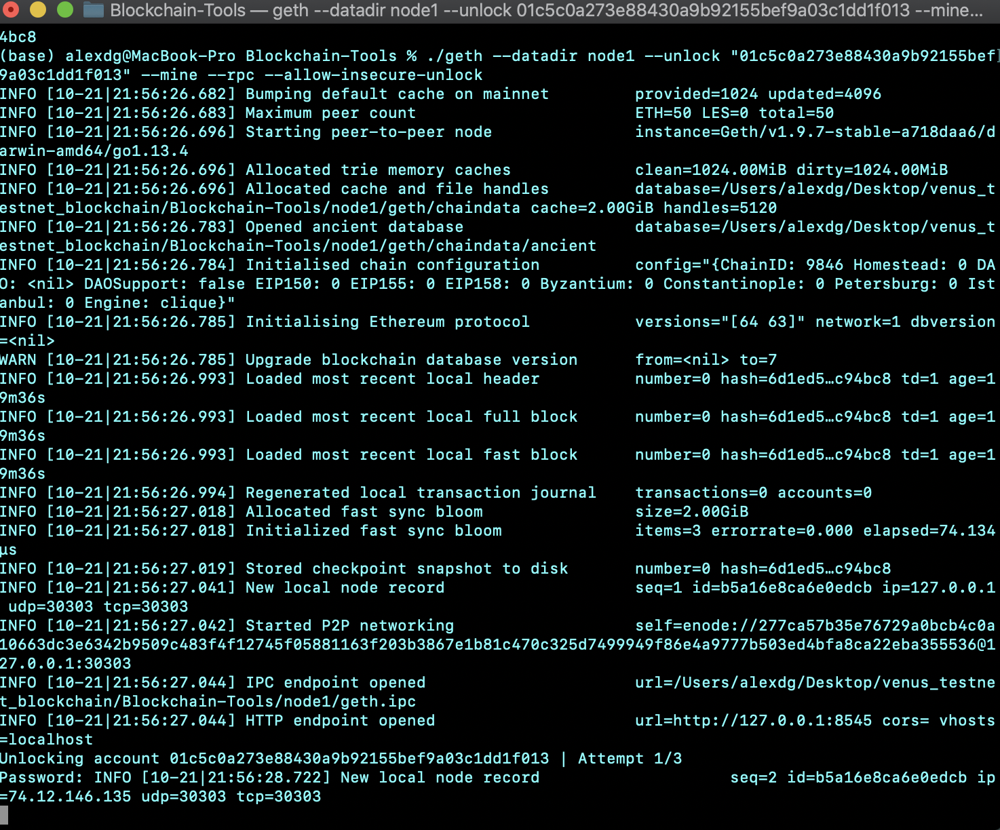

**Password Note**

If prompted for a password, input the following: `qbshwk` *the user may not see the typed values, continue to proceed and press enter.* 

### Identifying Reuqests in the Command

* The -- datadir flag is the data directory that indicates which node will be used

* The --mine flag tells the node to mine new blocks

* The --rpc flag enables the HTTP-RPC server

* The --allow-insecure-network flag allows insecure account to unlock when RPCs are exposed by HTTP. Prevents the HTTP error when added

## Venus Node_2 

Open a new terminal window or tab in the same directory to launch the second node in the Venus testnet custom netowkr. 

Once in the directory, launch the second node into mining using the following command: 

```bash
/geth --datadir node2 --unlock "0858dc8202e9cb78af6706daaef95bed3f20ee65" --mine --port 30304 --bootnodes "enode://277ca57b35e76729a0bcb4c0a10663dc3e6342b9509c483f4f12745f05881163f203b3867e1b81c470c325d7499949f86e4a9777b503ed4bfa8ca22eba355536@127.0.0.1:30303" --ipcdisable --allow-insecure-unlock
```

#### Confirming Node Launch Success 

After inputting the above command, the terminal window should appear to have the following format to ensure the successful launch of the first node. 

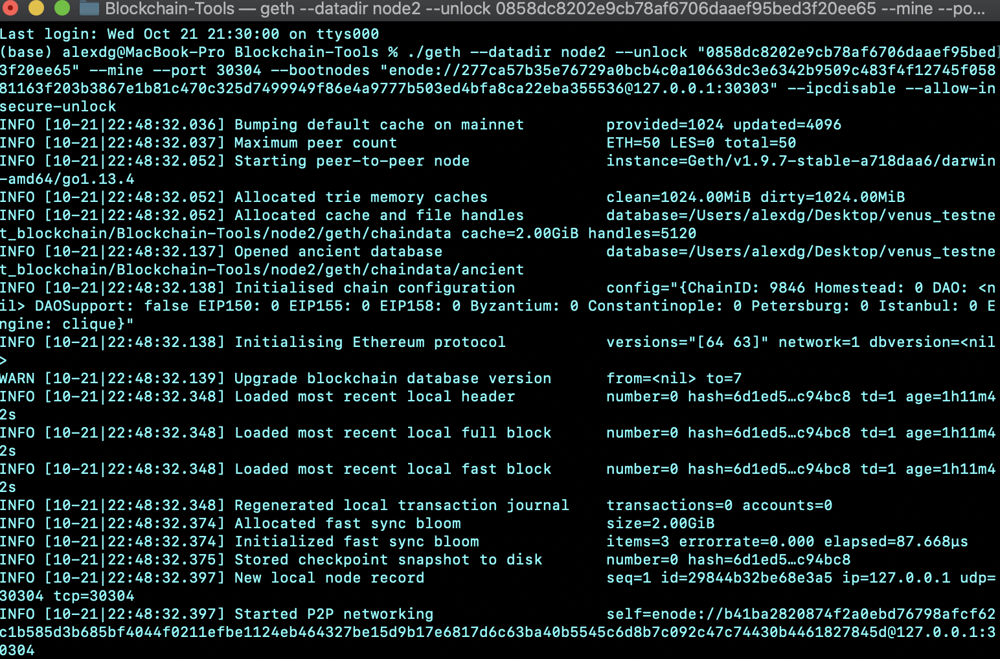

**Password Note**

The first command and the above command use the flag `--unlock` therefore, the user should not have to input a password to access the second node in the testnet network. 

### Identifying Reuqests in the Command

* The flag --port sets the port for the node to run. For example, if node_1 is running in port 30303 then node_2 must be set to 30304. Nodes cannot run in the same port. 

* The --bootnodes flag uses the enode address from node1 mining terminal so that node2 can a make connection with that node

    **The `self=encode`, `public address`, and `path of secret key file` can all be accessed in the [credentials.md](POA_custom_network/credentials.md) file.  

* The --ipcdisable flag disables the IPC_RPC server. It is used for windows if left out can raise errors due to server interferene 

### Confirming Successful Node Start

If all commands are inputted correctly, the users screen should immitate the following: 

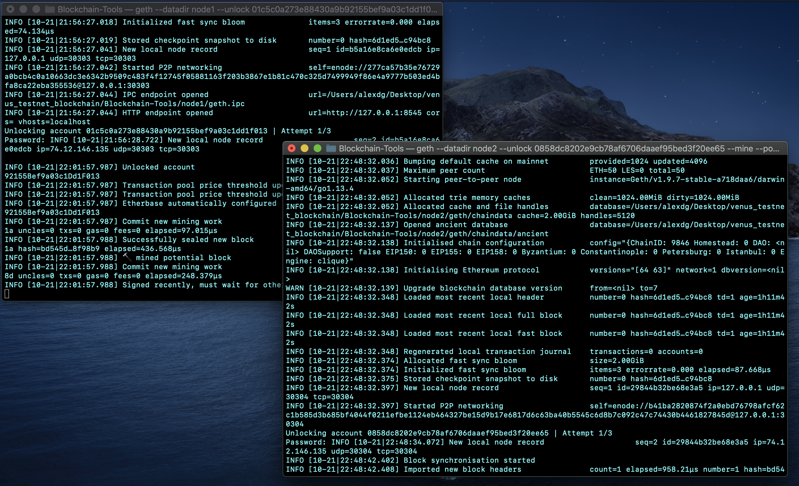

---

## Venus Testnet Network Transaction

Once the user has confirmed both nodes are mining successsfully, using the `MyCryptoApp`, a transaction can be processed following the steps outlined below. 

**Step 1** 

Navigating into the `MyCryptoApp` in the left side pane, locate the `Change Network` option. 

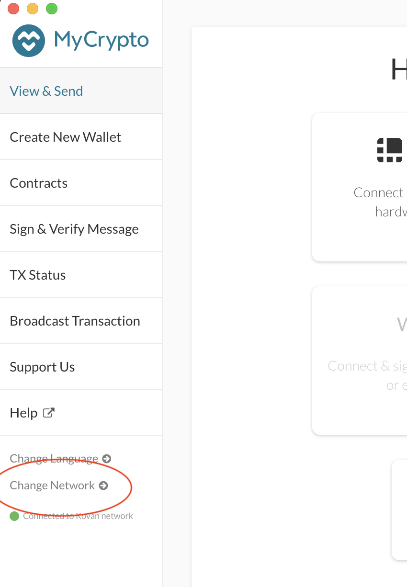

Select the option, then choose to `add a custom network` to deploy the node transaction. 

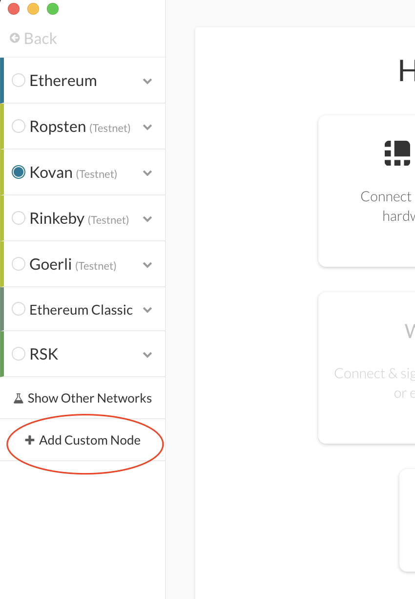

**Step 2** 

Follow the headers in this section to input the values shown below. The `Chain ID` is unique to the Venus custom testnet blockchain network. 

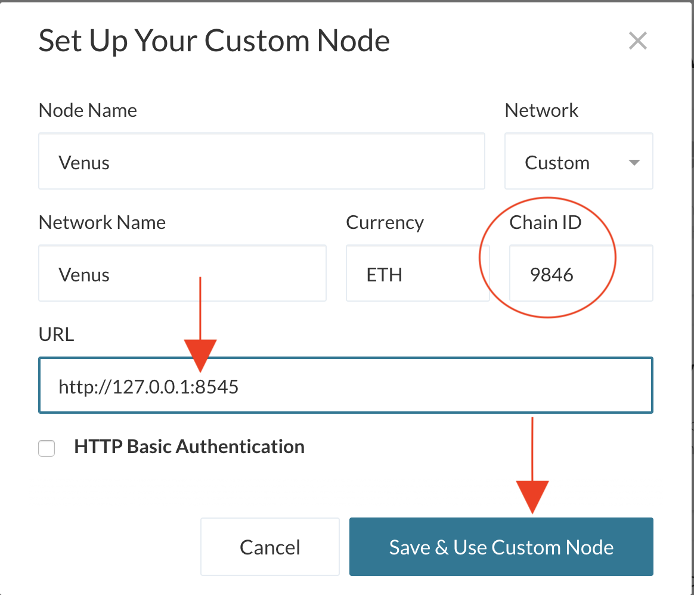

Confirm the addition of a new network has been successful. The left side bar should appear as the following: 

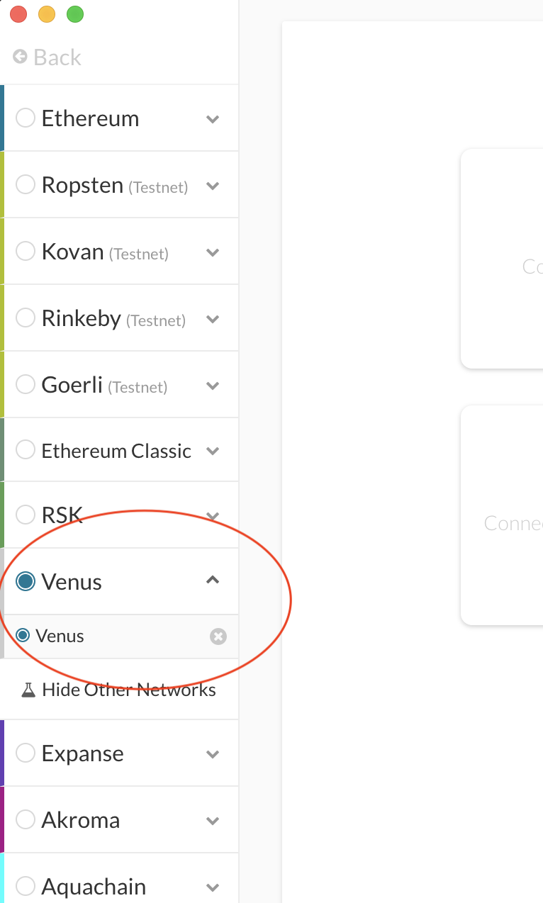

**Step 3** 

Now that this has been confrimed, navigate to the `Keystore` file option. Using the `Select Wallet File` option locate the `Keystore` file present in the `node1` directory. 

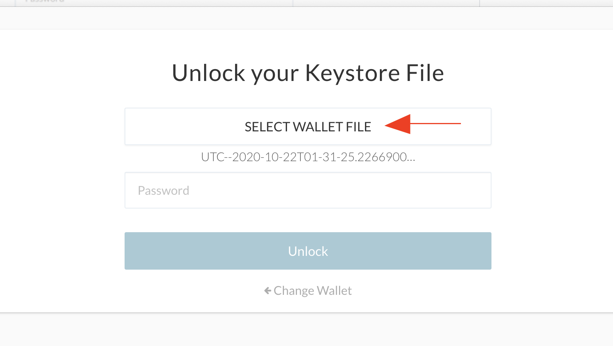

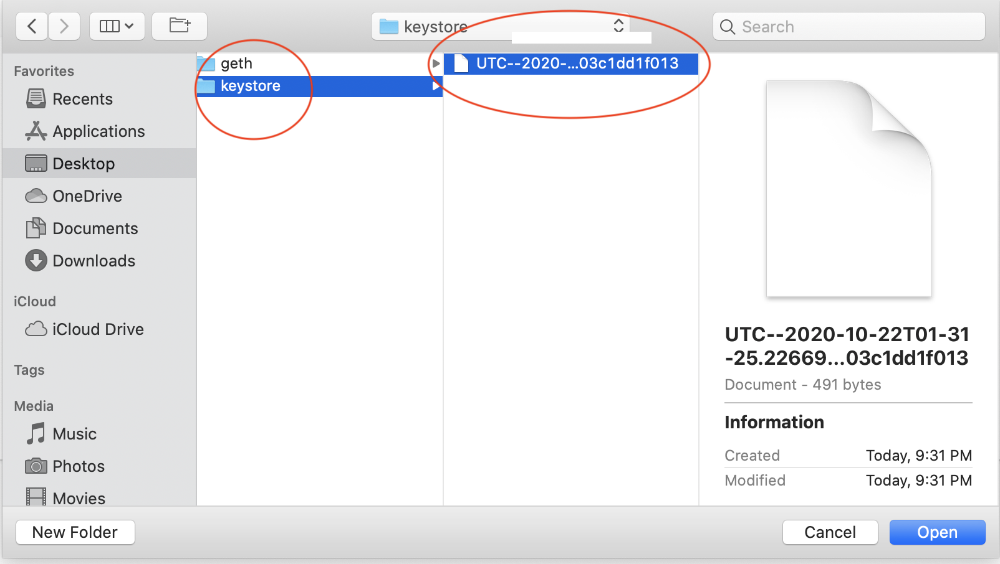

If the correct file was located, once the **password: qbshwk** is inputted, the `MyCryptoApp` will be re-dreicted to the following screen: 

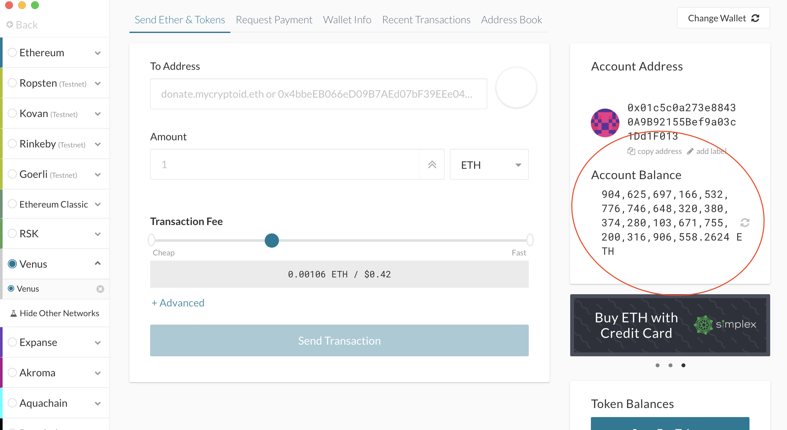

**Step 4** 

In the `Address` field, input the **Public Address Key: 0x0858dc8202e9cB78aF6706daaeF95bed3f20EE65** for node_2 and the desired amount.  

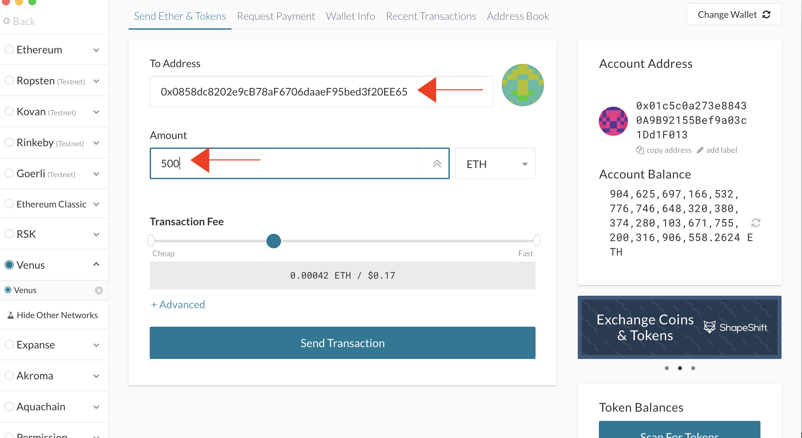

Confirm the transaction and press `send` 

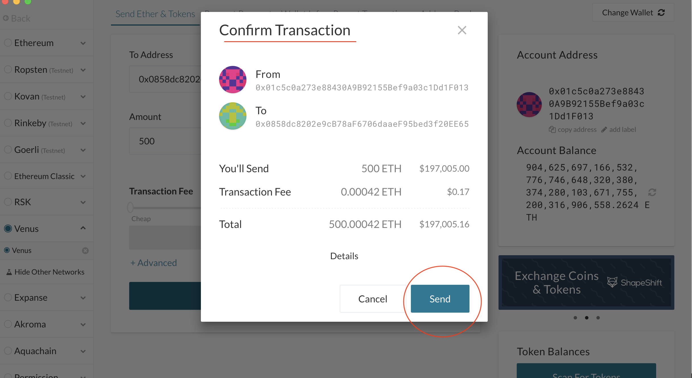

**Step 5** 

Click the  `TX Status` in the popup to verify the status of the transaction.

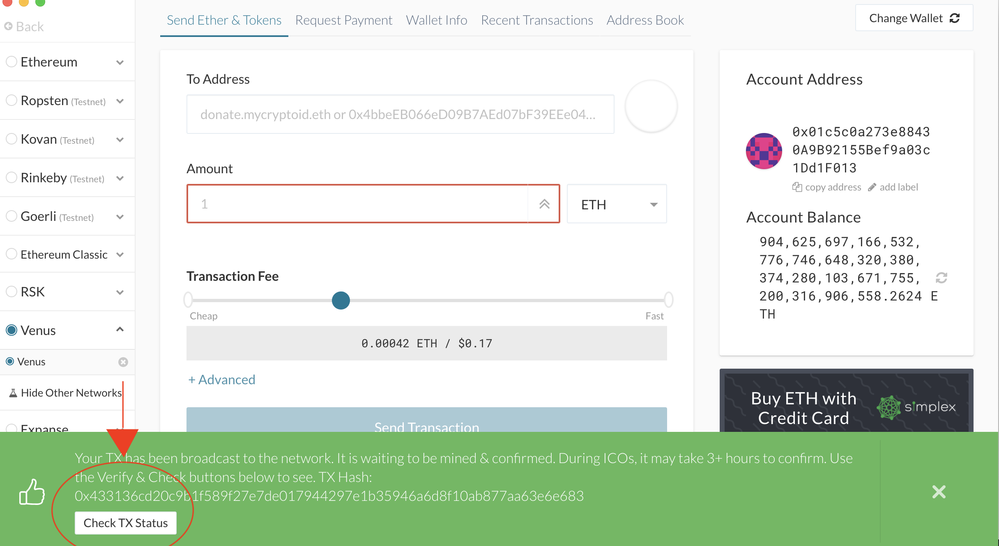

Transaction processing time may take up to 3 hours. As noticed from the image below that was taken immediently after the transaction was sent, the status is currently pending. 

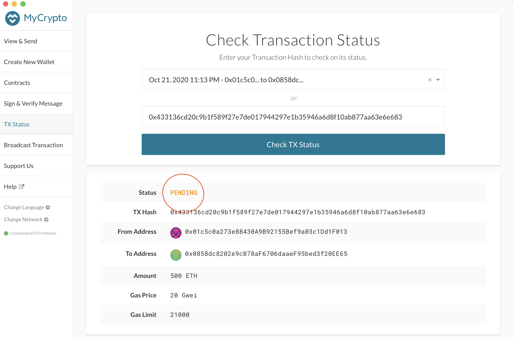

---

## File Contents

[Project Instructions](project_instructions.md)

[Blockchain Case Study](blockchain_case_study.md)

[POA Custom Network](POA_custom_network) 
* Within this directory there is a custom [network.json](POA_custom_network/venus.json) file and a [credentials.md](POA_custom_network/credentials.md) file that provides users with private access keys that may be required. 

[Screenshots](screenshots)

* This folder contains multiple directories outlining the node creation and initialization process, puppeth, and creatining a transaction in the MyCryptoApp. If the user would like to create their own nodes through the clique POA algoirthm, these screenshots can be referenced. 

---