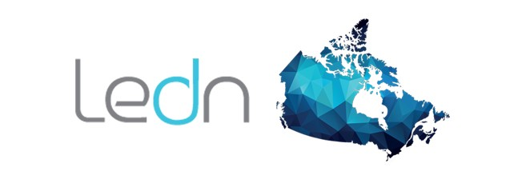

# Blockchain Case Study: Ledn Inc.

*The following case study proposal provides a brief background on a Canadian FinTech Blockchain firm striving to resolve pressing financial problems in the current market.*

---

## What Is It

Ledn Inc. ("Ledn) founded by Adam J. Reeds and Mauricio Di Bartolomeo in 2018 is a blockchain technology firm with a hub in the heart of the Toronto downtown core on a mission to provide financial services to assist bitcoin users develop savings. As of 2020, the firm offers their users three financial services that allow clients to build a bitcoin savings account, develop yields, and take out bitcoin backed loans. Currently, as a privately held corporation, Ledn focuses on building technology and operational processes that provide their clients the utmost transperancy in finanical services that provide better options and resources to create cryptocurrency saving accounts. 

As a FinTech, responding to market demand through innovative practices is a core business competency Ledn employs. Recognizing the growing demand in the crypto-economy for alternative loan and saving options in both dollar value and bitcoin value provided Ledn with their first service; 'bitcoin-backed loans.' The purpose of their service is to provide bitcoin users with better digital asset management through loan, savings, and credit services to do more with their crypto currency. 

As of 2020, the blockchain firm is announcing service expansion. Currently offering their clients the option to borrow and save in both bitcoin and Canadian dollar value, Ledn recongnizes the need to diversify its current service range. Partnering with Genesis, a global trading company, Ledn now offers their consumers the option to take out bitcoin loans and repay them in USD and CAD if they wish to do so. 

## Why This Matters

In the financial market, the requirement for transperancy is growing amongst consumers. Blockchain technologies offer users an honest and open platform appraoch to developing and gorwing financial assets in the crypto economy. However, the Canadian market for crypto-lenders and asset managers is limited at the current moment. Ledn is an improtant compeititor within the borrowing and saving domain within blockchain tehcnology firms. 

## Why This May be Interesting

The services the company is taking in the current crypto and finanical services economy is intresting because the firm is proactively making an effort to grow and innovate the future of financial services in blockchain. Additionally, a unique aspect of the financial services Ledn provides to their consumer is that borrowers do not have to sell their bitcoin to repay loans Ledn offers. Clients have the option to repay bitcoin-backed loans through dollar value or bitcoin depending on their preferences. Therefore, giving users the flexibility to manage their own digital assets. 

## Things to Keep in Mind for a Case Study

* Ledn provides three unique financial services;
1. Bitcoin Saving Accounts
2. Bitcoin-backed Dollar Loans
3. B2X Service to grow Bitcoin Assets 

* Ledn is currently gorwing their marketshare by parentering with Genesis, a global trading organziation. 

* Loans can be repaid in Bitcoin or Dollar value 

* Operates on the CoinDesk Bitcoin Price Index 

## Resources

[Ledn Background](https://www.ledn.io/en)

[Commonly Asked Ledn Questions](https://www.ledn.io/en/faq)

[Social Media](https://www.linkedin.com/company/ledn-inc/about/)

[Gensis Partnership](https://www.globenewswire.com/news-release/2020/05/14/2033610/0/en/Ledn-teams-up-with-Genesis-to-help-more-people-around-the-world-save-in-digital-assets.html)

